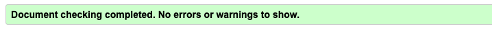
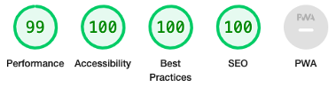

# The Loch Ness Pipers

Welcome to my first Code Institute project, The Loch Ness Pipers. The website has been created in order to create an online presence and awareness for a fictional event bagpiper business based in the Highlands of Scotland. With an array of different pipers, the website aims to promote and showcase the variety of pipers and services offered with a primary goal of leading potential customers to make their first initial contact with the business through the contact page.

## Demo

A live demo of the website can be found [here](https://dannymac90.github.io/PP1-Loch-Ness-Pipers/)

# User Experience (UX)

### First-time visitors
 - As a first-time visitor, I want to be able to easily and
   instinctively navigate the site to find what I need efficiently.
   As a first-time visitor, I want to clearly understand what the
   business is and what services it offers
   
 - As a first-time visitor, I want to know where the business is based
   to see if it is within my event area
   
   
 - As a first-time visitor, I want to easily be able to navigate to
   their social media pages to follow them and keep up with their latest
   news

### Potential Customers
 - As a potential customer, I want to know the location of the business to see if it is within my area of event
 
 - As a potential customer, I want to see a showcase of the pipers and their experience to see if they will be suitable for my event
 
 - As a potential customer, I want prices to be displayed to see if its within my budget
 
 - As a potential customer, I want to see events where I may be able to attend to see and speak to them face to face
 
 - As a potential customer, I want to easily be able to contact the business to discuss my requirements

# Strategy
My goal in the design was to make it as easy as possible to access information on the website while striving for a simple and user-friendly design.

# Features
### Existing Features
**Navigation Bar**
 - The navigation bar remains on the top of every page throughout the site. This ensures the user can easily navigate to any page they desire which in turn creates a good user experience
 - Through CSS, the menu will underline the current page using a blue bottom border. This lets the user easily identify which page they are currently on, making the website easier to navigate and more enjoyable.
 - To also create a further enjoyable user experience, a red colour bottom border will appear under links that hovered over
 - There is an embedded CTA button within the Nav menu to let the user quickly and easily be able to make further enquiries
 - For the responsive design, the nav bar menu will collapse into a hamburger menu to ensure the user has as much screen real-estate as possible to view the page content without having a chunky menu bar taking up a wide area of the screen
 
**Landing Page**
 - This introduces the user to The Loch Ness Pipers. 
 - It features a hero image of a bagpiper which will quickly let the user identify the purpose of the website along with the text overlay on the hero image stating the purpose of the business

**Footer**
 - Remains at the bottom of every page for consistency and a better user experience 
 - Contains social icons which have embedded links to those external websites. When the business starts trading and has these accounts set up, these links will lead directly to the companies social media pages
 
**About Page**
 - This second page details information about the business as a whole, but also show cases each individual piper
 - Each piper has a photo plus a short bio about them, helping the potential customer choose the piper best suited to their needs for their event
 - There is a CTA button below the pipers table that is centred and easily identifiable to the user so they can easily navigate to the contact page to make initial contact with the business. 

**Prices Page**
 - One of the main highlights from the user stories is having prices displayed on the site so they can easily and quickly establish if the business is within their price range. To enable this, we have implemented a dedicated prices page 
 - Within the prices page is a table with 3 columns stating the three main different services plus a price starting point. 
 - Within each column has its own CTA button to take the customer to the contact page to make further enquiries or book their piper. 
 
 **Event Page**
 - As an event piping business playing at both private and public events, the client requested an event page so potential customers could easily see what events they are playing at and when allowing the customer to go and see them perform and speak to them face to face
 - The event page contains a CTA button under the table to easily take the potential customer to the contact page to make further enquiries
 
 **Contact Page**
 - The websites primary goal is to drive customers to the contact page allowing them to make their first initial contact with the business
 - It was therefor essential to provide a clear and easily to follow fillable form as well as displaying the contact information of the business should the potential customer prefer to contact them in another way such as phone
 - It also contains an embedded Google map of where the business is located should the customer wish to attend the establishment to enquire more
 - With all 3 sections, this gives the customer plenty of options of how they wish to contact the business

**Contact-thankyou Page**
 - This is a submission confirmation page that is not visible in the navigation bar, but only appears following the potential customer completing the contact us form.
 - The page confirms successful submission and informs them the business aims to respond to all enquiries within 24 hours. 
 - The page then automatically redirects the user to the landing page after 10 seconds

## Features to implement in the future
**Testimony Page**
 - Once the business has started trading and undertaken events, we will add a testimony page to showcase the positive customer experience and feedback
 
 **Online availability / booking system**
 - This will help potential customers to further check the suitability of the business by showcasing if any pipers are available for their event date. This will also allow customers to book their chosen day and chosen piper for their event.

 **Media Page**
 - Once the business has started trading and undertaken events, a media page will be created hosting both photos and videos of pipers performing and showcase their skills and abilities.

# Technologies
 - HTML
 - CSS
 - Google Fonts
 
# Testing
## HTML Validator

Testing was conducted through W3C Nu HTML Checker
**The Results:** 
There was no errors or warnings found

## CSS Validator

Testing was conducted through W3C CSS Validator
**The Results:** 
There was no errors found

## Lighthouse Report

 - To test the Accessibility of the website, a Lighthouse test was conducted through Chrome DevTools
 - This confirmed an Accessibility score of 100%
 - Future site development will address the 99% performance score 
 
 
## Browser Compatibility Test
 Compatibility tests have been conducted as performed as expected on the following browsers:
 
 - Google Chrome
 - Apple Safari
 - Microsoft Edge
 - Mozilla Firefox
 
 ## Responsiveness Test
Responsiveness tests have been conducted as performed as expected on the following screen sizes using Chrome DevTools:
 - iPhone SE 375 x 667px
 - ipad 768 x 1024px
 - Macbook 2560 x 1600px
 - Lenovo Windows Laptop 1920 x 1080

 ## General Testing
 |Test Label| Test Action| Expected Outcome| Test outcome|
 |:---------|:-----------|:----------------|:------------|
 |Home Page | Click on home nav link| Home page loads| Pass|
 |CTA| Upon click, button takes you to Contact page| Navigated to Contact Page | Pass
 |Contact email| Enter text instead of email address| Warning popup saying to enter valid email| Pass
 |Thank you page| Submit filled form| Thank you page loads| Pass

 ## Bugs
 * No known bugs

 # Credits
**Content**
The text for the website was created by Danny MacLeod and proof-read/edited by Rebecca Haughey.

**Media**
The photos used throughout the site has been sourced from Adobe Stock Images

**Code**
CSS code for the hamburger menu was taken and then edited from Traversy Media Youtube channel [https://www.youtube.com/watch?v=DZg6UfS5zYg](https://www.youtube.com/watch?v=DZg6UfS5zYg)

Assistance with responsiveness and sorting bugs with my responsiveness was helped from Kevin Powell Youtube video [https://www.youtube.com/watch?v=bn-DQCifeQQ&t=2087s](https://www.youtube.com/watch?v=bn-DQCifeQQ&t=2087s)

**Acknowledgements** 
 - I received inspiration for this project from my own experience as an event piper
 - My mentor, Brian Macharia, for his expertise, help and professionalism
 - Kevin Powell for his helpful and insightful videos on YouTube

# Disclaimer
The content of this website is for educational purposes only.